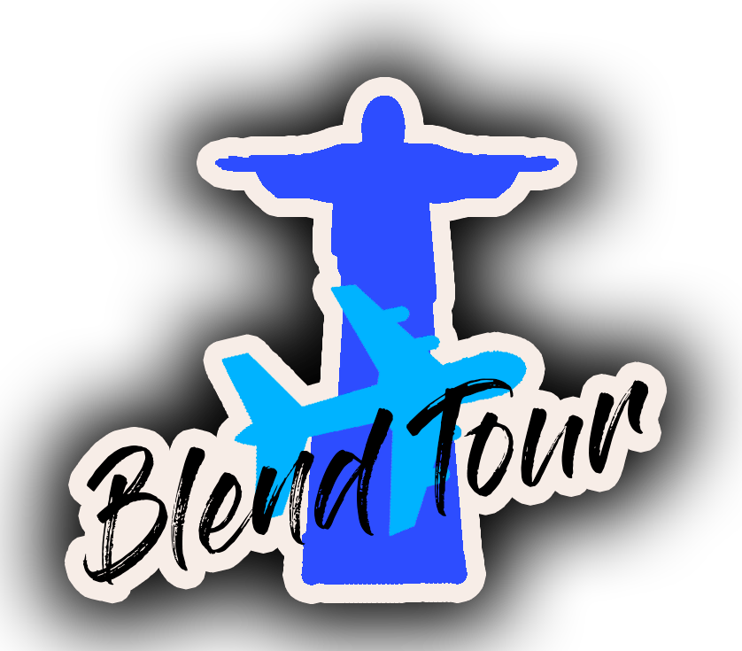
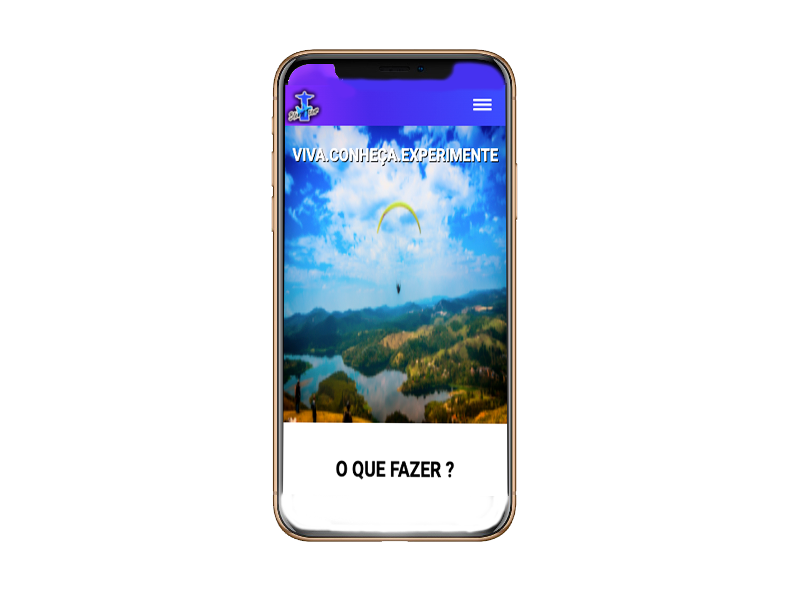
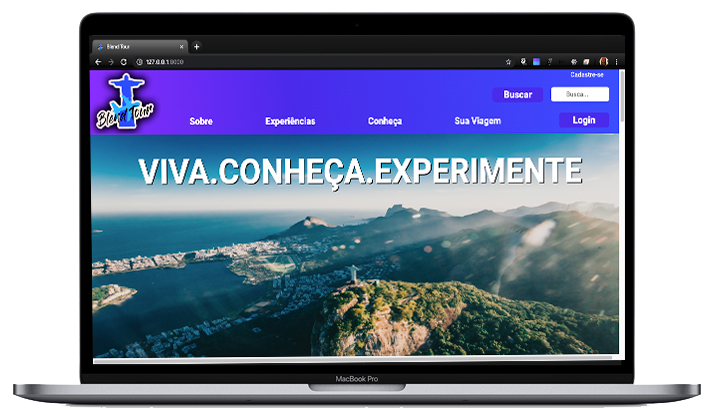

<h1 align="center">
     
</h1>

 

   <a href="#-tecnologias">Tecnologias</a>&nbsp;&nbsp;&nbsp;|&nbsp;&nbsp;&nbsp;
   <a href="#-projeto">Projeto</a>&nbsp;&nbsp;&nbsp;|&nbsp;&nbsp;&nbsp;
   <a href="#-licenca">Licença</a>
 

 

    
    
 

 ## :rocket: Tecnologias

 Esse projeto foi desenvolvido com as seguintes tecnologias:

 - [HTML](https://html.com/)
 - [CSS](https://developer.mozilla.org/pt-BR/docs/Web/CSS)
 - [PHP](https://www.php.net/)
 - [Laravel](https://laravel.com/)
 - [Javascript](https://www.javascript.com/)
 - [PayPal API](https://developer.paypal.com/docs/api/overview/)

 ## 💻 Projeto

 Projeto integrador referente ao curso de Full Stack da Digital House, elaborado utilizando todas as tecnologias que foram aprendidas no decorrer do curso. Para este projeto foi elaborado um e-commerce de 'experiências' turística, onde o cliente escolhe o que gostaria de fazer, baseado em algumas das categorias pré-estabelecidas.

 Se quiser ver o projeto, em versão live, você pode acessá-lo nesse [link]().

 ## :memo: Licença

 Esse projeto está sob a licença MIT. Veja o arquivo [LICENSE](LICENSE.md) para mais detalhes.

 ---
<h4 align="center">
   Code and coffee ☕
</h4>

